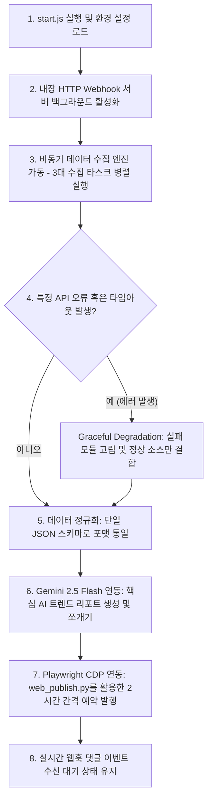
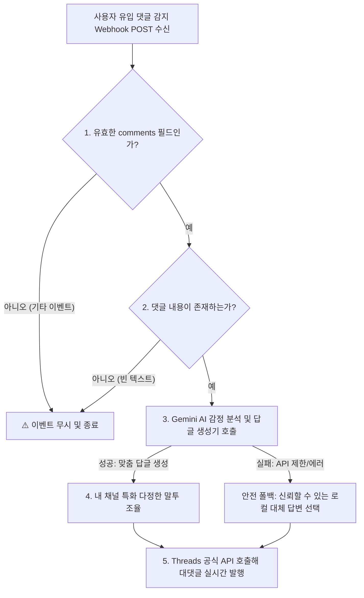

# Threads Autonomous Curation Agent - Architecture & Operations Playbook (v4.0)

이 문서는 Threads 공식 웹 인터페이스의 UI 구조와 Playwright Chrome CDP(Chrome DevTools Protocol) 및 다양한 테크 플랫폼의 교차 수집 API를 유기적으로 융합하여 작동하는 하이브리드 트렌드 큐레이터 에이전트(`start.js` + `web_publish.py`)의 작동 원리, 아키텍처 설계, 예외 고립화 전략 및 운영 장애 대처법을 수록한 **전문 엔지니어링 플레이북**입니다.

---

## 1. 에이전트 개요 (Agent Overview)

본 에이전트는 공식 API가 가지는 한계(예약 노출 불가, 백그라운드 sleep 만료 리스크)와 Puppeteer 헤드리스 크롤링의 차단 리스크를 **완벽히 극복**한 하이브리드형 지능형 오토메이션 에이전트입니다.
다양한 소셜 및 테크 플랫폼(X, Threads, Hacker News, GitHub)에서 바이럴되는 최신 AI 트렌드를 비동기 API로 가볍고 안전하게 수집·정규화하고, Gemini AI를 사용하여 고부가가치 큐레이션 콘텐츠를 가공하며, **사용자 크롬 세션을 복제한 CDP 원격 디버깅 포트(9222) Playwright 제어 장치**를 가동해 안전한 웹 예약 대기열 안착 및 'AI' 카테고리 매핑 발행까지 원스톱으로 처리합니다.

---

## 2. 시스템 아키텍처 및 라이프사이클 (Architecture & Lifecycle)

### 2-1. 에이전트 실행 수명 주기 (Lifecycle)



### 2-2. AI 의사결정 및 안전성 검증 트리 (AI Decision Tree)



---

## 3. 에이전트 7단 논리 계층 (The 7 Logical Layers of Project)

코드의 고유성과 유지보수 편의를 위해 본 프로젝트는 다음과 같이 엄격히 정돈된 **7개의 논리적 레이어**로 설계되었습니다.

1. **LAYER 1: 환경 설정 및 API 크레덴셜 로딩 (Constants & Credentials)**
   - API 호출용 크레덴셜(.env) 로드, 실행 모드(RUN_MODE) 설정 및 비동기 독립 수집/발행 모듈 바인딩.
2. **LAYER 2: Webhook 초경량 서버 구동 및 생명주기 관리 (Webhook Server Lifecycle)**
   - 외부 라이브러리(Express) 의존 없이 작동하는 http 내장 초경량 웹서버 기동 및 생명주기 관리부.
3. **LAYER 3: 비동기 데이터 수집 엔진 (Ingestion Pipeline)**
   - X/Threads 트렌드, 핵심 오피니언 리더, HackerNews/GitHub 딥다이브 모듈을 병렬 호출하고 에러를 격리 수집하는 계층.
4. **LAYER 4: 정규화 파서 및 Gemini 2.5 AI 큐레이터 연동 (Normalization & AI Curation)**
   - 원시 수집 데이터를 정규화하고 AI를 호출하던 레거시 로직을 전면 폐기하고, **에이전트 자율 스킬 기반 워크플로우(`curate_raw_posts/SKILL.md`)**로 100% 자율 대체.
5. **LAYER 5: Playwright Chrome CDP 기반 웹 UI 자동 포스팅 및 예약 장치 (Official Web Curation Publisher)**
   - `setup.py`로 띄워진 디버깅 크롬 9222 포트에 연결하여, `web_publish.py`를 호출해 텍스트/이미지 세팅, 'AI' 카테고리 매핑, 브라우저 현지 시간 동적 조회 및 2시간 릴레이 예약 등록을 수행하는 핵심 오퍼레이션 장치.
6. **LAYER 6: Webhook 기반 AI 자동 응대 핸들러 (Webhook Engagement Handler)**
   - 웹훅 서버를 통해 수신된 신규 사용자 댓글 정보를 파싱해 Gemini AI로 든든한 파트너 말투의 답글을 실시간 자동 발행하는 장치.
7. **LAYER 7: 메인 파이프라인 실행 스케줄러 및 오케스트레이터 (Main Orchestration & Shutdown)**
   - 전체 수명 주기를 제어하고, 에러 고립 장치를 통제하며, 로컬 모의 테스트용 시뮬레이터 구동을 조율하는 메인 진입 영역.

---

## 4. 에러 고립화 및 Graceful Degradation 기술

공개 환경에서 외부 API(RapidAPI, Apify 등) 연동 시 겪을 수 있는 네트워크 불안정 및 크레딧 소진 사태에 완벽하게 대비합니다.
*   **독립적 병렬 수집**: 3대 수집 모듈은 `Promise.allSettled`로 병렬 구동되어 상호 의존성을 배제합니다.
*   **에러 고립화**: X 트랙커 등 특정 모듈 실패 시 정상 성공분만 가공 레이어로 넘기며, 전체 수집 실패 시 로컬 Mock 데이터 장치가 즉각 가동되어 파이프라인의 붕괴를 원천 방어합니다.
*   **발행 UI 안전 토글**: 웹 예약 진행 중 '더 보기' 나 '예약...' 메뉴가 로딩 상태에 따라 토글되어 오작동하지 않도록 **토글-프루프(Toggle-proof) 클릭 검증 로직**이 내장되어 있습니다.

---

## 5. 초경량 내장 Webhook HTTP 서버 아키텍처

의존성 다이어트와 실행 안정성을 위해 외부 패키지 설치 없이 Node.js 빌트인 `http` 모듈만으로 구성된 Webhook 수신기를 탑재하고 있습니다.
*   **GET 챌린지 검증 지원**: Threads Webhook 최초 연동을 위해 들어오는 Meta의 `hub.challenge` GET 검증 요청을 `WEBHOOK_VERIFY_TOKEN`을 통해 완벽하게 식별 및 패스스루 처리합니다.
*   **POST 실시간 수신 및 파싱**: JSON 바디 버퍼를 안전하게 스트림 취합하여 파싱하고, `changes.field === 'comments'` 이벤트를 정확히 인터셉트하여 비동기 AI 감정 분석 장치로 격리 릴레이합니다.

---

## 6. 운영 장애 진단 및 복구 가이드 (Troubleshooting)

### 6-1. 크롬 디버깅 포트(9222) 연결 실패
*   **증상**: `❌ 연결 실패! setup.py로 크롬이 실행되어 있는지 확인하세요` 오류 발생.
*   **진단**: 원격 디버깅 크롬이 아예 꺼져 있거나 다른 프로세스가 포트를 점유함.
*   **조치**:
    1. 터미널에서 `python3 setup.py`를 실행하여 디버깅 전용 Chrome을 정상 기동시킵니다.
    2. 만약 포트가 충돌한다면 `lsof -i :9222`로 포트를 점유하고 있는 프로세스 PID를 찾아 `kill -9 PID`한 후 다시 setup.py를 돌립니다.

### 6-2. 예약 시간 오입력 버그 (시간 기입 꼬임)
*   **증상**: 스크립트에는 2시간 뒤로 정상 계산되었으나 달력 팝업 창에 기존의 기본 시간대(예: 오전 11:00) 그대로 완료 처리됨.
*   **진단**: 포커스 탭(Tab) 조작 딜레이로 인해 입력 포커스가 엉뚱한 버튼(예: 지난달 버튼)으로 흘러가 `hh`, `mm` 창에 값을 기입하지 못하고 완료를 누름.
*   **조치**:
    1. 코드에 직접 Selector인 `input[placeholder="hh"]` / `input[placeholder="mm"]` 을 지정해 `fill()`과 `type()`으로 때려 박는 다이렉트 Fill 방식을 적용했습니다.
    2. 스크립트 실행 시 `--schedule "2"` 와 같이 상대 시간 정수를 넘겨주면, 자바스크립트로 브라우저의 진짜 현지 시각을 100% 완벽히 긁어와 시차 오차를 제거합니다.

### 6-3. 최종 예약 버튼 클릭 실패 (Locator Timeout)
*   **증상**: `Locator.click: Timeout 30000ms exceeded. waiting for locator("text="예약"").last` 발생.
*   **진단**: 달력 완료 버튼을 누른 후 달력 팝업 레이어가 걷히고 최종 게시물 버튼 텍스트가 `'게시'`에서 `'예약'`으로 전환되는 데 걸리는 딜레이(1~2초)를 견디지 못하고 성급히 클릭하여 에러 발생.
*   **조치**: '완료' 클릭 후 넉넉하게 `page.wait_for_timeout(3000)` (3초 대기)를 보장하고, `div[role="button"]:has-text("예약")` 셀렉터를 `last` 또는 visible 순회 기법으로 타격하여 해결했습니다.

### 6-4. 달력 오늘 날짜(1일) 토글 해제 버그
*   **증상**: 달력 팝업이 열려 있는 상태에서 시간 입력 인풋창(`hh`/`mm`)이 갑자기 사라지거나 보이지 않아 대기 시간 초과 에러 발생.
*   **진단**: Threads 달력 UI는 열릴 때 기본적으로 '오늘 날짜'가 이미 선택되어 있고 시간 입력 창이 노출된 상태입니다. 이때 코드가 오늘 날짜 단추(예: 1일)를 또다시 강제 클릭하면 선택이 **토글(Toggle) 해제**되어 날짜 선택이 취소되고 시간 인풋 창이 닫혀 숨겨지는 원리였습니다.
*   **조치**: 날짜 클릭을 시도하기 전에 달력 내 `hh` 및 `mm` 인풋 요소가 이미 보이는지(`is_visible()`) 먼저 점검하고, 인풋이 이미 활성화되어 있다면 날짜 단추 클릭 단계를 생략하고 즉시 시간 값을 채워 넣도록 수정했습니다.

### 6-5. 느린 타이핑 속도로 인한 봇 의심 및 비효율 해결 (클립보드 붙여넣기 튜닝)
*   **증상**: 긴 본문 텍스트를 한 글자씩 타이핑하면서 포스팅 속도가 매우 느려지고, Playwright가 오래 동작하며, 비자연스러움이 노출될 우려가 있음.
*   **진단**: 사람은 긴 본문을 타이핑하기보다는 일반적으로 타 편집기에서 복사한 후 붙여넣는 방식을 즐겨 사용합니다. 한 글자씩 타이핑하는 방식은 낭비가 큽니다.
*   **조치**: 본문 텍스트를 시스템 클립보드에 복사(`pbcopy`)한 후, Playwright 단축키 조합(`Cmd+V`)을 통해 한 번에 입력 영역에 붙여넣도록 개편했습니다. 속도가 획기적으로 향상되었으며, 사람의 일반적인 작문 패턴과 더 높은 싱크로율을 보여 봇 탐지 우회 효과도 극대화되었습니다.

### 6-6. 프로젝트 내부 파일 생성 시 IsArtifact 파라미터 에러
* **증상**: `IsArtifact`를 `true`로 설정하고 프로젝트 폴더(예: `output/...`) 하위에 파일을 생성할 때 경로 검증 에러 발생.
* **진단**: 안티그래비티 도구 규격 상 `IsArtifact: true`는 IDE 전용 관리 경로(`.gemini/antigravity-ide/brain/...`)에 저장되는 설계용 아티팩트에만 사용하도록 제한되어 있습니다.
* **조치**: 프로젝트 소스 폴더 및 배포용 파일(`output/` 폴더 내부 등)을 새로 생성 및 작성할 때는 반드시 `IsArtifact: false`로 설정하고 `ArtifactMetadata`를 생략해야 합니다.

---

## 7. 에이전트 자율 가동 스킬 시스템 (Agent Autonomous Skills)

본 에이전트는 다차원 AI 및 소셜 네트워크 환경에서 사람의 개입 없이 독립적인 자율 작업(Task)을 수행할 수 있도록 **선언적 폴더 기반의 에이전트 전용 스킬 규격서(Declarative Skills)**를 탑재하고 있습니다. 

### 7-1. 스킬 폴더 아키텍처 (Skill Tree Schema)

```text
.agents/
└── skills/
    ├── ingest_raw_posts/      # [수집 스킬] 데이터 수집 및 타임스탬프 폴더 생성 서브시스템
    │   └── SKILL.md           # 어제 날짜(D-1) 기준 크롤링 수행 및 raw 파일 생성
    │
    ├── curate_raw_posts/      # [가공 스킬] raw 마크다운 데이터의 명품 Curation 및 번역 서브시스템
    │   └── SKILL.md           # 번역, 요약, AI Slop 소거, 다정한 반말체 윤문
    │
    ├── extract_publishing_drafts/ # [추출 스킬] 상위 초안을 6개 파일로 분리하고 이미지 다이어그램 함께 생성
    │   └── SKILL.md           # 초안 분리 스크립트 구동 및 create_twitter_image 연동
    │
    └── publish_to_threads/    # [발행 스킬] Playwright CDP를 활용한 Threads Web UI 자동 포스팅 및 예약
        ├── SKILL.md           # setup.py 연동, 카테고리 'AI' 연계, 브라우저 현지 시간 조회 및 예약 스케줄러 기동 규격
        └── scripts/
            └── web_publish.py # 핵심 자동화 파이썬 코어 스크립트
```

### 7-2. 스킬 자율 순환 생명주기 (Data Flow & Operations)

```mermaid
graph LR
    A[ingest_raw_posts/SKILL.md 로드] --> B[1. D-1 기준 Apify API 기동]
    B --> C[2. output/YYMMDD_HHMM/ 폴더 생성 및 raw 파일 생성]
    C --> D[create_raw_posts/SKILL.md 로드]
    D --> E[3. 외부 참조 링크 Axios 추출 및 딥리딩 분석]
    E --> F[4. Gemini 2.5 Flash를 통한 한국어 큐레이션&반말체 윤문]
    F --> G[5. 완성형 완제품 thread_*.md 및 twitter_*.md 발행 완료]
    G --> H[6. publish_to_threads/SKILL.md 로드]
    H --> I[7. web_publish.py 구동하여 'AI' 카테고리 매핑 및 2시간 간격 릴레이 예약 등록 마감]
```



### 7-3. 스킬별 상세 오퍼레이션 규격 (Execution Specifications)

#### 3. 발행 스킬: `publish_to_threads/SKILL.md`
- **목적**: 완성된 6개의 명품 요약 텍스트와 png 이미지를 Playwright 브라우저 자동화 스크립트를 기동해 Threads 대기열에 2시간 간격 릴레이 예약 포스팅하는 것입니다.
- **핵심 프로세스**:
  1. `setup.py`로 구동 중인 원격 디버깅 포트(9222)가 활성화되어 있는지 점검합니다.
  2. `web_publish.py`를 호출하여 글쓰기 창에 텍스트와 이미지를 로드합니다.
  3. `커뮤니티 또는 주제` 버튼 영역을 클릭하고 팝업에서 `AI` 카테고리를 선택합니다.
  4. `--schedule "X"` (X: 2, 4, 6, 8, 10) 정수가 넘어올 경우, 브라우저의 Javascript를 호출해 진짜 현지 로컬 시간대를 읽어와 오차 없이 2시간 간격 뒤로 예약을 설정합니다.
  5. 달력 팝업 내 시/분 인풋 박스에 값을 다이렉트로 기입(`fill`)하고 완료를 누른 후 3초 대기 뒤 최종 예약 전송을 마감합니다.
